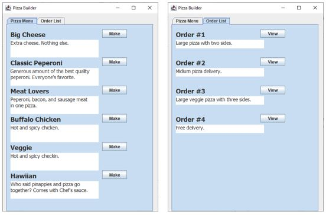
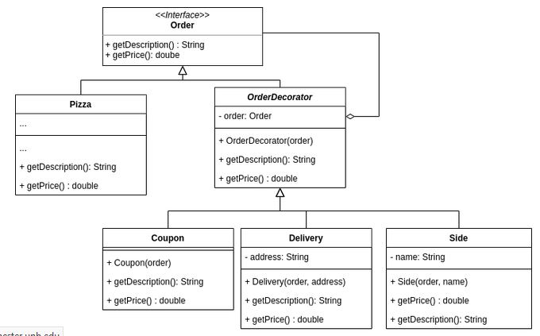

# Lab4: Pizza Builder

# Objectives

- Learn how to use and implement Builder Design Pattern
- Learn how to use and implement Decorator Design Pattern

# Work

1. Pizza Builder creates different pizza orders and shows the order list.
2. The program uses the builder and decorator design patterns.
3. `Lab4.java` is the main Java file which defines all the window components. You don't need to make any changes to the file.
4. To create new Pizzas independently and increase the code readability, apply the fluent builder pattern to the `Pizza` class.
5. :computer: **Complete the static inner class `Builder` within the `Pizza` class that allows to use the method chaining to add toppings.**
 It should have the `build()` method that initializes and returns new fresh pizza. In the end, you should be able to build pizza instances like:

        Pizza pizza = new Pizza.Builder(PizzaSize.MEDIUM)
            .addPineapple()
            .addChicken()
            .addPeppers()
            .build();

6. `Order` is defined as an interface in `Order.java`. It is implemented by the `OrderDecorator` and `Pizza` classes. The `OrderDecorator` class is extended by the `Coupon`, `Delivery`, and `Side` classes.

7. :computer: **Complete the `Side` class. Use $3 for each side.**

---
End of Lab4

